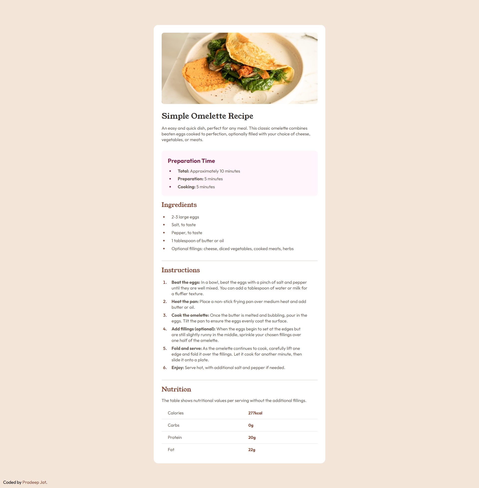

# Frontend Mentor - Recipe page solution

This is a solution to the [Recipe page challenge on Frontend Mentor](https://www.frontendmentor.io/challenges/recipe-page-KiTsR8QQKm). Frontend Mentor challenges help you improve your coding skills by building realistic projects. 

## Table of contents

- [Overview](#overview)
  - [Screenshot](#screenshot)
  - [Links](#links)
  - [Built with](#built-with)
- [Author](#author)

## Overview

### Screenshot

### Links

- Solution URL: [Solution Here](https://github.com/mobphycho100/Frontend-Mentor-Recipe-page)
- Live Site URL: [Live Site](https://your-live-site-url.com)

### Built with

- Semantic HTML5 markup
- CSS custom properties
- Flexbox
- Mobile-first workflow

## Author

- Website - [Pradeep Jat](https://pradeepjat.netlify.app)
- Frontend Mentor - [@mobphycho100](https://www.frontendmentor.io/profile/@mobphycho100)
- LinkedIn - [@pradeepjat](https://www.linkedin.com/in/pradeepjat/)

